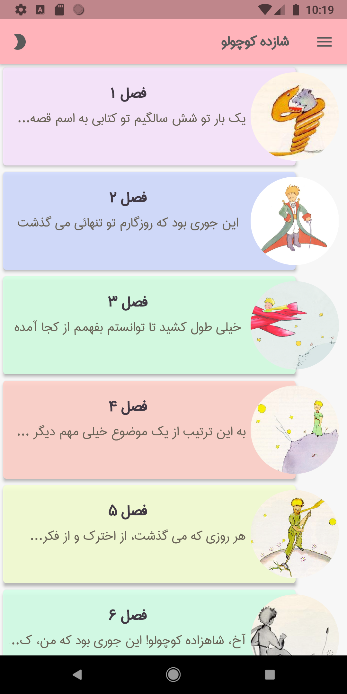
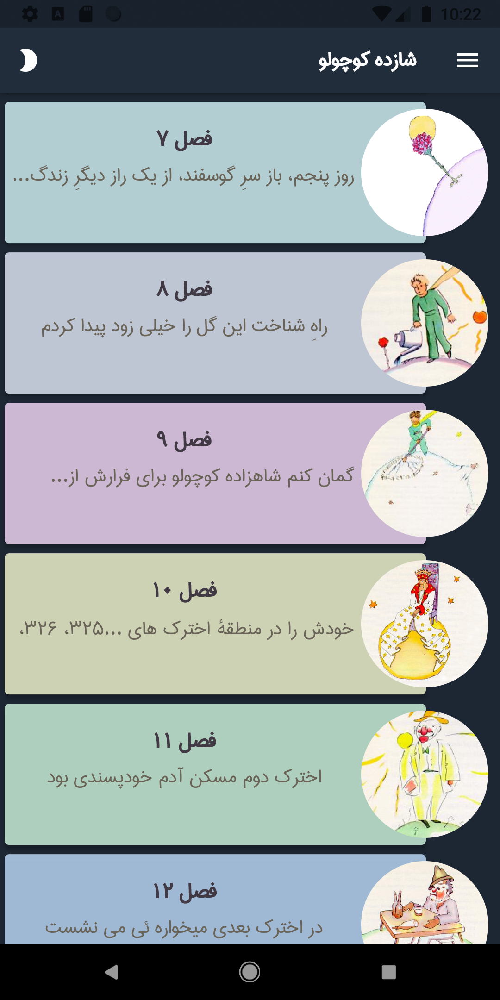
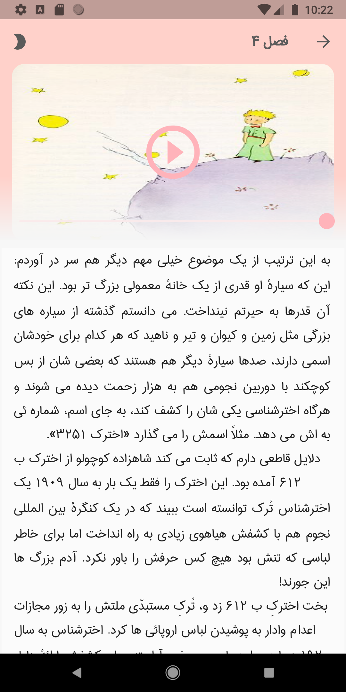
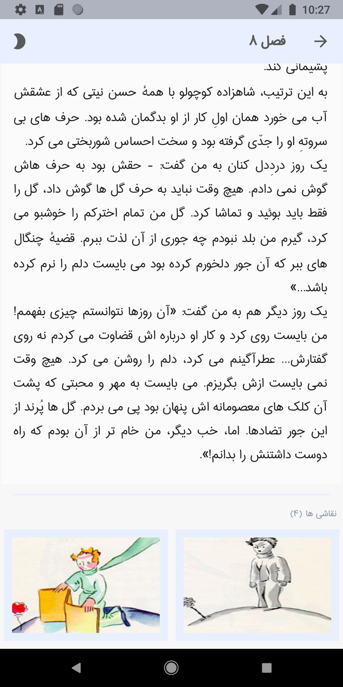
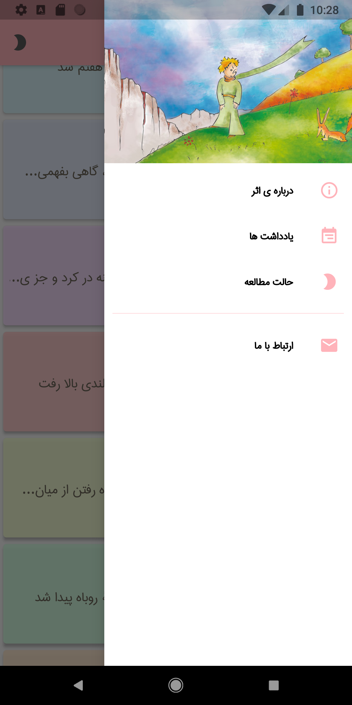
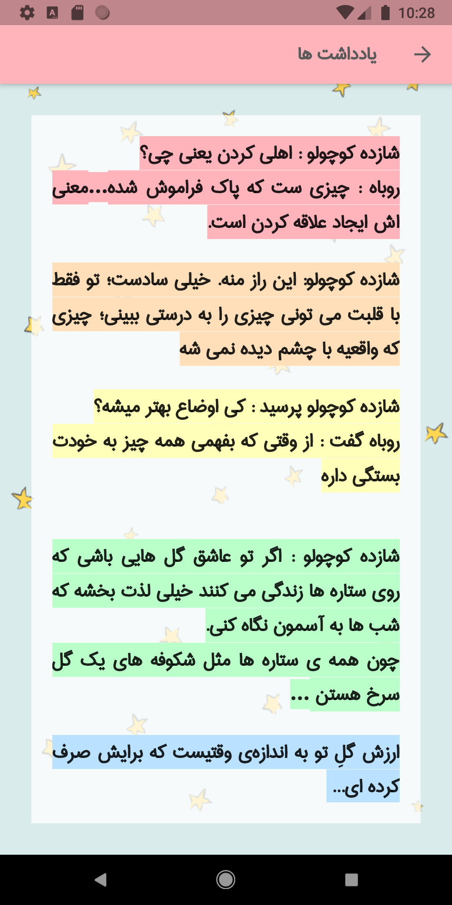
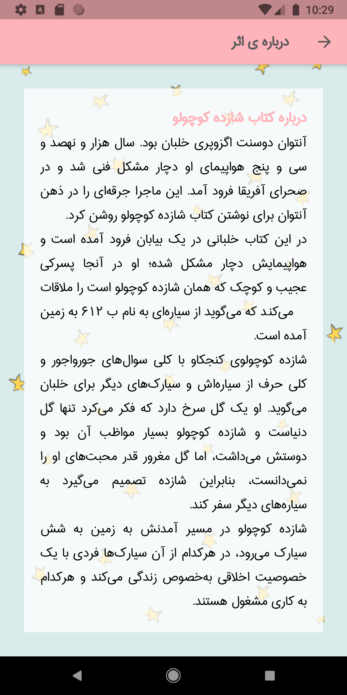

# 📖 The Little Prince App (Flutter)

This application is built with **Flutter** and includes the following features:

- 🌞🌙 **Light and Dark themes**
- 📚 **Full text of The Little Prince**
- 🎧 **Audio version narrated by Ahmad Shamlou (in Persian)**
- 💬 **A collection of the most beautiful and thought-provoking dialogues**

---

## 💡 Selected Dialogues

> Little Prince: What does “taming” mean?  
> Fox: It’s something that’s been forgotten... It means creating ties.

> Little Prince: This is my secret. It’s very simple: One sees clearly only with the heart. Anything essential is invisible to the eyes.

> The value of your rose is the time you’ve devoted to her.

---

## ⚙️ Tech Stack

- Flutter  
- Dart  

---

## ✨ Screenshots

  
  
  
  

  
  
  
  

